# ECS World Command Architecture Framework (Engine-Independent)

## 1. Overview

This framework defines a world-simulation-first ECS architecture where:

- the ECS world is the single source of truth
- systems communicate via commands, plus translated feedback events when execution re-enters gameplay
- the engine is only a rendering and execution adapter
- the game remains portable across engines
- gameplay logic stays decoupled from rendering and platform code

Implementation-boundary note:

- when gameplay is shipped as a game DLL or shared library, the engine adapter belongs to the engine/host side, not inside the gameplay DLL
- the gameplay DLL should expose only engine-agnostic public entry points, world-facing engine commands, and translated feedback/input contracts
- the engine-side host is responsible for loading the DLL, calling its public API, translating engine-native input into the DLL's input contract, and translating DLL-emitted engine commands into actual engine work

The system is designed for:

- engine independence such as Unreal, Godot, custom runtime, or CLI mock
- multiplayer server authority
- AI-generated gameplay modules
- long-term reusable ECS systems

---

## 2. Core Philosophy

### 2.1 World-First Simulation

The ECS world fully defines gameplay state.

> The engine never decides gameplay outcomes.

---

### 2.2 Command-Driven Communication

All cross-system interaction is done through:

- commands for intents, actions, and cross-ownership requests
- translated feedback events for execution observations that re-enter from the engine adapter
- commands describe gameplay meaning published by a producer, not a private RPC addressed to one named consumer
- a producer must not encode or assume which systems will listen to a command, or how many listeners there will be
- zero, one, or many systems may consume the same command if that command's meaning matters to their owned behavior
- command-schema changes are shared-contract changes and should be kept stable unless the gameplay meaning itself truly changes
- the command queue should dispatch a command only to systems that explicitly subscribe to that command type
- systems that do not subscribe to a command type must not process it
- there is no internal gameplay-event queue; internal cross-system gameplay communication uses commands
- translated feedback-event queues should use the same enum-indexed subscriber-list dispatch pattern as commands
- systems should coordinate through subscribed command consumption, translated feedback-event consumption, and owned-state observation only, not through direct peer calls or peer-state writes

No direct system-to-system calls are allowed.

---

### 2.3 Engine Is A Passive Executor

Engine responsibilities:

- rendering
- physics execution when needed
- audio and VFX playback
- input capture
- reporting execution-side feedback events such as physics callbacks when needed

The engine does not contain gameplay logic.

Execution-side callbacks are observations, not authority.

They only matter to gameplay after they are translated back into world language and accepted by world systems.

---

### 2.4 Engine Commands Stay In World Abstraction

The world may emit engine commands that are meant for engine execution, but those commands must still remain in the world's abstraction layer.

The world should emit commands like:

- an entity moved from `x` to `y`
- an attack was resolved
- an entity appeared or was removed

The world should not emit commands like:

- spawn this particle effect
- play this engine animation asset
- create this engine actor type

---

## 3. Architecture Pipeline

```mermaid
flowchart LR
    subgraph ENGINE[Engine Layer]
        A[Input Sources<br/>Engine Input / AI / Network]
        B[Adapter Resolves Semantic Host Events]
        C[Engine Pre-Physics Update]
        G[Engine Command Flush Phase 1]
        H[Engine Physics Tick]
        I[Adapter Translates Engine Feedback]
        J[Engine Post-Physics Update]
        N[Engine Command Flush Phase 2]
        P[Render / Audio Presentation]
    end

    subgraph GAME[Game Layer]
        D[Core Gameplay Phase 1 Entry]
        E[ECS Tick<br/>Systems + Components]
        F[Internal Command Flush Phase 1]
        K[Core Gameplay Phase 2 Entry]
        L[Translated Feedback Handling Phase]
        M[Internal Command Flush Phase 2]
        O[End Of Frame / Updated World State]
    end

    A --> B
    B --> C
    C --> D
    D --> E
    E --> F
    F --> G
    G --> H
    H --> I
    I --> J
    J --> K
    K --> L
    L --> M
    M --> N
    N --> P
    P --> O
```

Notes:

- the ECS world is the gameplay authority
- the world command stream is just the internal command flow being flushed and handled
- engine pre-physics update is where the engine enters core gameplay phase 1
- core gameplay phase 1 happens before engine-layer physics tick
- engine post-physics update is where the engine enters core gameplay phase 2
- core gameplay phase 2 happens after engine-layer physics tick
- engine commands still belong to the world abstraction layer
- the engine adapter translates those engine commands into actual engine actions
- execution-side feedback can return from the engine during physics or other execution, but it must re-enter the world only through translated world-level feedback events
- execution-side feedback is observational only; it does not decide outcomes by itself, and world systems may accept it, reinterpret it, or ignore it
- input sources should first be translated by the engine adapter into semantic host events before gameplay tick
- the adapter may submit host-event records in two frame windows: before phase 1 and between phase 1 and phase 2; continuous control events needed for phase-1 simulation belong only in the pre-phase-1 window
- phase 1 may accumulate engine commands that are flushed before engine-layer physics tick
- translated engine feedback seeds phase-2 world processing
- phase 2 may also accumulate engine commands, but phase-2 engine flush is terminal for the frame
- no same-frame gameplay feedback loop continues after phase-2 engine flush

### 3.1 Host Event Intake Contract

The architecture uses one semantic host-event boundary before gameplay tick.

Rules:

- the engine adapter owns conversion from engine input, AI decisions, network packets, or other runtime input sources into semantic `HostEvent` records
- host-event intake happens before gameplay tick; any continuous control needed for phase-1 simulation must be submitted before phase 1 begins
- gameplay code must not consume engine-native input objects or raw device state
- alternate input sources such as replay, recording playback, AI, or multiplayer synchronization should enter through the same adapter-owned translation path and produce the same semantic host-event contract

Clarification:

- in this document, `host-event intake` means the adapter translates source-specific input data into semantic world/gameplay events before submitting them to gameplay
- this translation may use adapter-owned camera state or presentation-only context when needed
- a continuous control such as site movement may be expressed as one per-frame semantic host event, for example a world-space move-direction event
- if no such event is submitted for a frame, gameplay must treat that control as absent for that frame rather than reusing last frame's value
- semantic host-rendered UI interactions use the same host-event path; translated feedback events remain a separate execution-feedback ingress path

---

## 4. Data Model Design

### 4.1 Core Schema (Global Shared)

Examples of what may belong to core schema:

- `EntityID`
- host-event queue envelope rules
- phase-entry request/response structs
- basic metadata
- `CommandHeader` for type routing and system ownership

Rules:

- engine independent
- never game-specific
- never includes gameplay logic
- may include shared queue/event transport and phase-entry contracts used by host and gameplay runtime code
- may define the transport-level queue envelope and payload-block rules used by command and feedback-event queues across all games
- should contain only data that is truly architecture-wide or broadly shared across many games and features

Ownership rule for schemas, components, resources, and queue-entry layouts:

- a data layout should live in the lowest layer that truly owns its meaning and reuse scope
- core owns architecture-wide data and transport contracts
- reusable features own reusable gameplay-domain data
- the game layer owns project-specific composition data
- a commonly used concept such as position or transform is not automatically core just because many games use it; it belongs in core only if this architecture truly wants it as a universal shared contract

---

### 4.2 Feature Schemas (Reusable Modules)

Reusable gameplay concepts.

Examples:

- `MoveIntent`
- `ApplyDamage`
- `ShootCommand`
- `SpawnIntent`
- `TranslatedHitContact`

Rules:

- shared across multiple games when applicable
- no system coupling allowed
- only define data contracts
- a feature module should primarily depend on schemas it defines itself plus upper core schemas
- a feature module should separate its public schema from its private internal schema
- a feature module must not require direct schema access to a peer feature module's private schema
- a feature module may intentionally depend on a peer feature module's public schema when that public contract is part of the integration design
- ordinary reusable cross-feature gameplay interaction should happen through public feature commands
- game-specific integration commands/shared state belong to the game layer and should be translated there into reusable feature public contracts when needed
- events are mainly reserved for translated execution feedback that re-enters from the engine-adapter side
- feature modules may define their own command payload meanings, while still using the shared core queue envelope

Public feature schema may include:

- feature-owned public components or resources that are specific to that feature rather than universally shared core data
- feature-owned public command layouts
- feature-owned queue-entry ids that other modules are allowed to consume through that feature's public contract

Private feature schema may include:

- feature-private internal components
- feature-private internal commands
- implementation-only layouts that should not be depended on outside that feature

---

### 4.3 Game-Specific Schemas

These:

- are used only in one game
- extend feature schemas when needed
- contain gameplay-specific rules and data
- may define game-specific command and event payload meanings on top of the same shared queue transport
- may define integration contracts when multiple reusable features need to cooperate only in this specific game

---

## 5. System Design

Each system:

- processes ECS entities with matching components
- reads and writes world state
- emits commands and may consume translated feedback events during normal phase handling
- never directly calls other systems

Example systems:

- `MovementSystem`
- `WeaponSystem`
- `ProjectileSystem`
- `CombatSystem`
- `AISystem`

Rule:

> Systems depend only on schemas, not on other systems.

Input rule:

- systems may consume semantic host events or runtime-prepared transient per-phase control data during tick
- if a system owns the relevant ECS data, it may react by writing that owned data directly
- if reacting to input requires another ownership domain to change, the system should emit commands instead of mutating non-owned state directly

### 5.1 Direct Write Ownership

Each system must have an explicit ECS ownership boundary.

That ownership boundary defines:

- which components, resources, or state blocks the system may write directly
- which components, resources, or state blocks the system may only read
- which cross-domain effects must be emitted as commands instead of direct writes

Rules:

- a system may write only the ECS data it owns
- non-owned ECS data is read-only to that system
- if a system needs another ownership domain to change, it must emit a command for the owning system or module to resolve
- command flow is the mechanism for requesting changes in another ownership domain, not only for cosmetic signaling
- if a system needs to react to another system's published gameplay meaning, it should do so by subscribing to the relevant command type rather than by directly calling that system
- if a system needs to react to translated execution feedback, it should subscribe to the relevant feedback-event type
- a system must not bypass the queue by directly mutating another ownership domain even if that state is reachable through a shared runtime context

This prevents hidden coupling through arbitrary shared-state mutation.

### 5.2 Feature-Module Access Boundary

For a system that belongs to a reusable feature module:

- it may access the schemas defined by that feature module
- it may access upper core schemas
- it must not directly depend on a peer feature module's private schema
- it may intentionally depend on a peer feature module's public schema only when that dependency is part of an explicit integration contract

If reusable features need to cooperate, they should do so through:

- public feature schema owned by the feature exposing that contract
- shared upper-level schemas when the meaning is truly architecture-wide
- game-specific integration schema when the coupling exists only in this one game, with the game layer responsible for translating that meaning back into reusable feature public contracts if needed

---

## 6. Command System

### 6.1 Command Types

#### A. Internal Commands

Used only inside ECS simulation.

Examples:

- `MoveResolved`
- `ApplyDamage`
- `AdjustFactionReputation`

These are not exposed to the engine.

Transport rule:

- internal commands travel through the shared world queue-entry transport
- the queue transport belongs to core architecture
- the command meaning does not need to belong to core; feature modules and game-specific layers may define their own payload meaning

---

#### B. Engine Commands (Internal Command Subtype)

These are still internal commands in the world layer, but they are the subset meant for the engine adapter to translate into actual engine actions.

Examples:

- `EntityMoved`
- `AttackResolved`
- `EntitySpawned`
- `EntityRemoved`
- `StateChanged`

Rules:

- must stay in world abstraction, not engine-native abstraction
- contain no gameplay logic
- represent world meaning, not rendering micro-steps
- the engine adapter decides how to express them with actors, particles, sounds, animation, or physics hooks
- they should travel through the same internal-command flush and handling flow as other internal commands

---

#### C. Engine Feedback Events

These originate from engine-side execution, mostly from physics or collision callbacks, but they do not enter the world directly as engine-native data.

They are execution observations, not authoritative gameplay outcomes.

Examples:

- physics contact callback
- overlap begin or end
- trace hit result
- animation notify if used as execution feedback

Rules:

- engine feedback must first be captured by the engine adapter
- the engine adapter must translate it into world-level feedback events before re-entering the ECS world
- the engine adapter should resolve engine-native references such as actors, bodies, or colliders back into world identifiers before emitting translated feedback
- translated feedback does not mutate gameplay state by itself; world systems decide whether it has gameplay meaning
- no gameplay rule may depend directly on raw engine-native callback data

### 6.1.1 Shared Queue Envelope Versus Payload Meaning

The queue mechanism is shared across games, but the meaning of each command or event is layered.

The design rule is:

- core architecture owns the queue transport, entry header, routing metadata, and payload-block contract
- reusable feature modules may define reusable command and event meanings
- game-specific layers may define game-specific command and event meanings

So the shared queue is cross-game, but the payload interpretation is not forced into core.

Core should know:

- how a queue entry is queued
- how it is routed
- how large the payload block may be
- which phase and kind the queue entry belongs to

Core should not need to know:

- the gameplay-specific fields of a movement command
- the gameplay-specific fields of a combat command
- the gameplay-specific fields of a contract-board or site-session command

This keeps the transport reusable while keeping gameplay meaning modular.

Meaning-ownership rule:

- core owns how queue-entry layouts are described, routed, and queued
- a feature owns the public command layouts that describe requests against its own public state
- a game-specific layer owns queue-entry layouts that exist only because this game composes features in a unique way

So a queue-entry definition should live in the lowest layer that truly owns that meaning, not automatically in core.

Data-driven-definition rule:

- the queue transport does not require one host-language struct type per command or event kind
- the shared queue may carry one generic world queue-entry packet plus an entry id and fixed payload block
- entry ids are interpreted through shared layout definitions owned by core, feature, or game layers as appropriate
- a system should decode only the queue-entry layouts its layer is allowed to know

### 6.1.2 Public Command Contracts And Feedback Event Contracts

Not every command contract should be globally visible.

The design should distinguish:

- private feature commands, used only inside one feature
- public feature commands, intended as part of that feature's reusable contract
- game-specific integration commands, intended only for this game's composition
- translated execution-feedback event contracts, which re-enter from the engine-adapter side and are observational input rather than the normal cross-feature gameplay-integration mechanism

This means:

- another reusable feature may intentionally consume a feature's public command definition
- the game layer may consume reusable feature public commands and game-specific integration commands
- reusable feature modules should not need to know game-specific integration command layouts directly
- if game-specific integration should affect a reusable feature, the game layer should translate that meaning into the feature's public command contract
- translated feedback events should be consumed only by systems that need that execution observation
- no module should depend on another feature's private command definition

### 6.1.3 Command And Feedback Event Contract Ownership Rule

When deciding where a command or feedback-event contract belongs, use the ownership of the meaning:

- a command contract should belong to the lowest layer that owns the gameplay meaning being published
- a command should not be named or shaped as a private request to one specific consumer system
- an execution-feedback event should belong to the translated engine-feedback contract that reports that observation back into gameplay
- if the concept is broadly reusable across several features, it may belong to a separate shared reusable feature contract
- if the coupling exists only in this one game, the contract should belong to game-specific integration schema

Example direction:

- if one feature validates an attack impact, it should emit a semantic command that describes that impact, not a private RPC addressed only to health
- health, armor, stagger, threat, analytics, or other systems may listen to that same command if their behavior depends on that meaning
- each listener must resolve only its own owned state and may emit follow-up commands if more cross-owner effects are needed
- the game layer should observe results through owned/public state or follow-up commands, not by reaching into another feature's private data

Concrete example:

- engine feedback enters gameplay through a translated feedback event such as `TranslatedHitContact`
- the attack feature validates whether that translated hit should become real gameplay damage
- the attack feature emits a semantic gameplay command such as `AttackImpactResolved` that carries source/target identity plus hit power
- the health feature may listen to that command and resolve HP change inside owned health state
- an armor-durability or stagger feature may also listen to that same command and resolve its own owned state
- the command producer does not need to know which systems consumed the command
- the health feature exposes the resolved damage through public health-facing result/state
- the game layer reads that resolved health result/state, checks whether the target was a protected village asset, applies its own penalty rule, and emits `AdjustFactionReputation`
- the `FactionReputation` feature resolves that command inside its own owned state
- no peer feature needs direct calls into another feature for this flow; commands plus owned/public state are enough

Parallel-development rule:

- once a command schema is established, prefer changing listener behavior over changing the schema for one consumer's convenience
- keeping command layouts stable reduces coupling and lets multiple developers or AI agents work on separate systems in parallel without merge-heavy coordination on command definitions
- subscription-based command and translated feedback-event queues should be the forcing function that prevents direct cross-system dependencies from creeping back in

This keeps ownership, write authority, and contract meaning aligned.

### 6.1.4 Fixed Payload-Block Rule

Each queued world queue entry should use a fixed-size inline payload block.

The fixed payload block exists so that:

- queue memory stays contiguous
- pushing and popping queue entries stays allocation-free in the normal case
- flushing remains cache-friendly
- queue behavior stays predictable across all games

Design consequences:

- the payload block size is a shared transport limit, not a gameplay rule
- small gameplay commands and translated feedback events should fit directly into that fixed block
- if a logical queue entry would exceed the fixed block size, it should not force a different queue structure

Oversized-entry rule:

- the preferred solution is to send an identifier, handle, or reference to data already owned elsewhere in world state
- if the logical queue entry is naturally a sequence or batch, it may be split into multiple queued entries and reconstructed by the handling logic
- the queue contract should stay fixed-size even when some gameplay meanings need larger logical data

---

### 6.2 Command Flow

```mermaid
flowchart LR
    A[Systems] --> B[InternalCommandQueue]
    B --> C[Internal Command Flush Phase 1]
    C --> D[EngineCommandQueue]
    D --> E[Engine Command Flush Phase 1]
    E --> F[Engine Feedback Events]
    F --> G[Translated Feedback Handling Phase]
    G --> H[InternalCommandQueue]
    H --> I[Internal Command Flush Phase 2]
    I --> J[EngineCommandQueue]
    J --> K[Engine Command Flush Phase 2<br/>Terminal This Frame]
```

Interpretation:

- systems emit either internal/gameplay commands or engine commands
- there are two global runtime queues: `InternalCommandQueue` and `EngineCommandQueue`
- internal/gameplay command flush always happens before engine command flush
- internal/gameplay command flush drains `InternalCommandQueue` until it is empty
- engine commands emitted while internal commands are being flushed are appended into `EngineCommandQueue`
- engine command flush drains `EngineCommandQueue` only after the internal queue is stable
- engine-side feedback has gameplay meaning only when the adapter emits translated world-level feedback events; otherwise the callback is ignored
- phase 2 repeats the same queue order
- the phase-2 engine command flush is terminal for the frame and does not create another same-frame gameplay feedback loop

### 6.3 Command Queue Timing Contract

The core queue behavior is now fixed. The main remaining open implementation note is the lack of a debug/safety guard for accidental infinite command cycles during drain-until-empty behavior.

Locked rules:

- `InternalCommandQueue` is drained strictly FIFO
- `EngineCommandQueue` also uses FIFO append and drain behavior
- any command emitted during a flush is appended to its matching queue and resolved later by normal queue order, never executed re-entrantly inside the current handler
- phase-1 engine execution may emit translated world-level feedback events; those events are consumed by listening systems or the game layer during phase 2, and any follow-up commands they emit are appended into `InternalCommandQueue` for the phase-2 flush
- phase-2 engine command flush does not emit same-frame gameplay feedback or reopen world processing
- if a backend still produces callbacks during phase-2 engine command flush, the adapter may translate them into world-level feedback events, but those events must be buffered for the next frame
- if the adapter does not emit a translated feedback event for a callback, that callback is ignored by gameplay

Current queue rule:

- there are exactly two global queues: `InternalCommandQueue` and `EngineCommandQueue`
- command flush means internal/gameplay command flush unless otherwise stated
- internal/gameplay command flush drains `InternalCommandQueue` strictly FIFO until empty
- engine command flush happens only after internal/gameplay command flush becomes stable
- phase 1 and phase 2 may both emit engine commands into the same global `EngineCommandQueue`
- only the phase-1 engine command flush may feed into same-frame execution feedback and world re-entry; phase-2 engine command flush does not
- phase-2 engine command flush is terminal for the frame

Recommended first safety guard:

- keep a per-flush processed-entry counter in debug builds
- set a high temporary ceiling such as `10_000` processed queue entries for one flush
- if that ceiling is exceeded, stop the flush, log the last handled queue-entry ids and types, and fail fast in debug/test builds
- this is only a development safety net; it does not change normal FIFO behavior or become gameplay logic

Validation note:

- `validation purposes` here means optional debug-time checks that enforce architectural phase rules, not a separate gameplay system
- example: if a future contract says some command family is illegal during adapter translation or illegal during a specific phase, debug validation can flag that immediately
- if no such phase-specific bans are wanted yet, the contract should say that explicitly and keep validation limited to queue-shape invariants such as queue kind, phase ordering, and non-re-entrant execution

This two-queue model is usually the safest default because it keeps command emission simple, avoids re-entrant execution, and preserves a readable frame structure.

---

## 7. Engine Adapter Layer

Each engine adapter implements:

- receiving world-level engine commands
- maintaining projected presentation state and any engine-native object mappings needed to represent long-lived surfaces such as regional map, site world, and host-rendered UI
- translating those commands into engine actors, transforms, VFX, SFX, and animation
- executing physics when needed
- handling input handoff
- capturing engine-side feedback events from execution
- resolving engine-native references back into world identifiers when possible
- translating those feedback events back into world-level feedback events

Ownership rule:

- the engine adapter is engine-side infrastructure
- it should live in the engine host, engine plugin, launcher, or other runtime integration layer that is allowed to touch engine-native APIs
- it should not be required to live inside the gameplay DLL itself
- the gameplay side should know only the adapter-facing public contracts, not the engine-native implementation

Frame-side entry contract:

- before engine pre-physics update, the adapter may submit host events already resolved by the host, such as host-rendered UI actions from the previous visible frame
- during engine pre-physics update, the engine should call the core gameplay phase-1 entry point
- during engine physics tick, the adapter may collect engine-native callbacks and translate them into world-level feedback records
- after phase-1 engine-command flush and before engine post-physics update, the adapter may submit another host-event batch for interactions that became resolvable only after phase-1 playback
- during engine post-physics update, the engine should call the core gameplay phase-2 entry point
- phase 2 is where translated feedback events are handled first, listening systems or the game layer may emit follow-up commands, then the internal command queue is flushed again, and finally the engine command queue is flushed again

Backends may include:

- Unreal Engine adapter
- Godot adapter
- CLI mock adapter

Rules:

- no gameplay logic
- translation and execution layer only
- outward engine commands must stay in world abstraction
- no engine-specific asset concepts may leak back into gameplay schemas
- adapter behavior should be deterministic with respect to the received engine commands
- for long-lived presentation surfaces, the adapter should build its projected world from authoritative bootstrap state and then apply later authoritative partial state updates onto that projected world rather than rebuilding the entire surface every frame
- the adapter should keep stable mapping keys from gameplay-facing identity such as ids or site-local coordinates to engine-native objects and update those mappings when objects are created or removed
- engine-side feedback must re-enter the world through translated world feedback events, not through direct gameplay mutation
- engine-side feedback is observational input only; the adapter may report what happened in execution, but only world systems may decide the gameplay consequence

---

## 8. Input And Command Flow

The engine adapter should first translate source input into semantic host events in gameplay language.

Gameplay code then processes those events during phase handling.

Input does not always need to become commands.

If a system or runtime phase handler owns the affected gameplay state, it may react directly by writing that owned data.

If input should cause changes in another ownership domain, the system should emit commands.

Examples of input-triggered commands when cross-domain handoff is needed:

- `MoveIntent`
- `ShootIntent`
- `InteractionIntent`

Examples of direct owned-state reaction:

- a movement-related system or runtime phase handler consumes a transient world-space move-direction event and updates owned locomotion state
- a camera-related system remains adapter-owned and should not leak camera state into gameplay

Those commands, when emitted, are then processed by ECS systems during normal command flush.

### 8.1 Host Event Ownership And Buffering Contract

The input boundary is now locked as follows:

- the engine adapter owns all conversion from engine-native input, replay input, AI input, or network input into semantic host events
- input translation must complete before core gameplay phase 1 begins
- continuous control events needed for fixed-step simulation, such as site movement, must be submitted in the pre-phase-1 host-event window
- gameplay phase 1 may reuse one submitted control event across all fixed steps executed during that same phase 1
- if no continuous control event arrives for a frame, gameplay must treat that control as absent for that frame
- gameplay code may derive transient per-phase control caches from submitted host events, but those caches are runtime-owned and cleared each frame
- any source input that arrives after the phase-1 cutoff should be buffered for the next frame rather than mutating the current frame's submitted host events
- host events may still be submitted again between phase 1 and phase 2 for discrete resolved interactions or adapter work that completed after the phase-1 flush
- translated engine feedback events from physics, collision, or animation callbacks are not input and must not be folded back into the current frame's control interpretation; they re-enter gameplay only through the translated feedback-event path in phase 2 or a later frame as already defined elsewhere in this document
- if several input sources can drive the same actor, the adapter must resolve that ownership before emitting the final semantic host events for that frame
- raw button, cursor, or camera-state data must not cross the DLL boundary when gameplay can instead consume semantic world-space intent

Recommended implementation direction:

- keep the host-event queue as the only public gameplay ingress path besides phase entry and feedback events
- derive transient per-phase control data from pre-phase-1 host events when repeated fixed-step consumption is needed
- clear transient control data at phase boundaries so no last-frame movement or camera-relative intent is retained implicitly

This locks the ownership and buffering boundary strongly enough for later system-design work without forcing one engine-specific implementation.

Example:

```mermaid
flowchart LR
    A[Player Input] --> B[Adapter Resolves Semantic Host Events]
    B --> C[Engine Pre-Physics Update]
    C --> D[Submit Pre-Phase1 Host Events + Enter Gameplay Phase 1]
    D --> E[Gameplay Systems During Tick]
    E --> F[Owned State Writes<br/>and Optional Commands]
    F --> G[Internal Command Flush Phase 1]
    G --> H[Engine Command Flush Phase 1]
    H --> I[Engine Physics Tick]
    I --> J[Adapter Translates Physics / Collision Feedback]
    J --> K[Engine Post-Physics Update]
    K --> L[Submit Between-Phase Host Events + Enter Gameplay Phase 2]
    L --> M[Translated Feedback Handling + Internal Command Flush Phase 2 + Engine Command Flush Phase 2]
```

The final world-level feedback event should describe the execution observation in world terms such as entity-to-entity contact, overlap, or trace result.

World systems still decide whether that translated feedback causes pickup, damage, blocking, or no gameplay effect at all.

---

## 9. Multiplayer Model (Optional Extension)

### Server Authority Model

The server runs the full ECS simulation:

- processes all inputs
- executes systems
- produces authoritative world commands
- consumes translated execution feedback events that re-enter the world loop

Clients:

- receive engine commands or synchronized world results
- replay visual results
- do not run authoritative simulation logic

---

## 10. Build Strategy

### Phase 1: Monolithic Game (Current Phase)

- everything lives in one project
- strict layering is enforced
- no early modular extraction

### Phase 2: Extraction After Shipping

Extract only:

- proven reusable systems
- stable schema definitions
- repeated gameplay patterns

Rule:

> Extract only after real usage proves reuse value.

---

## 11. Key Constraints

### MUST

- systems communicate only via ECS state plus commands, with translated feedback events reserved for execution observations
- the engine never affects simulation outcomes
- engine commands exposed to the adapter must stay in world abstraction
- engine feedback must re-enter the world through translated world feedback events
- schemas are strictly separated by scope
- each system has an explicit direct-write ownership boundary
- reusable feature-module systems may access their own schemas, upper core schemas, and peer-feature public schemas when an explicit integration contract allows it

### MUST NOT

- direct system-to-system calls
- gameplay logic inside the engine layer
- premature abstraction
- cross-system ownership violations
- peer-feature private-schema dependency, or peer-feature public-schema dependency without an explicit integration contract, inside reusable feature modules

---

## 12. Mental Model

- ECS world = simulation brain
- systems = behavior processors
- commands = world language
- engine adapter = interpreter and execution bridge
- engine feedback = execution observations that must be translated back into world language
- engine = execution device

---

## 13. Final Goal

This architecture enables:

- engine independence
- reusable ECS gameplay modules
- AI-assisted system generation
- multiplayer-ready deterministic design
- a long-term scalable game framework
